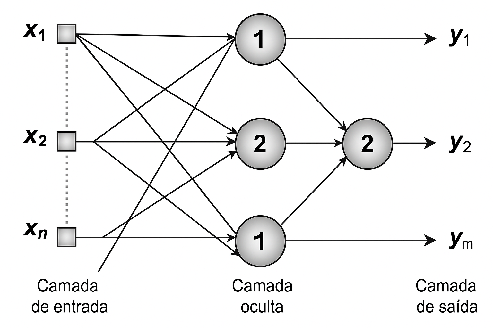

# Meu Projeto Perceptron 

Este projeto demonstra como uma **rede neural simples (MLP)** pode aprender as funções lógicas `AND`, `OR` e `XOR` — e como esse conhecimento pode ser usado para controlar ações em um pequeno **jogo de simulação** baseado em lógica binária.

## Lógica e Inteligência Artificial

A rede neural é do tipo **MLP (Perceptron Multicamadas)** com:

Entrada: 2 neurônios (energia e presença do inimigo)

Camada Oculta 1: 8 neurônios — função de ativação **ReLU**

Camada Oculta 2: 6 neurônios — função de ativação **ReLU**

Saída: 3 neurônios — função de ativação **Sigmoid** para representar AND, OR, XOR

Usei o **Adam Optimizer (Adaptive Moment Estimation)** porque:

- Combina as vantagens dos métodos AdaGrad e RMSProp
  
- Ajusta dinamicamente a taxa de aprendizado para cada peso da rede
  
- Converge mais rápido e com mais estabilidade do que o SGD (gradiente descendente simples)

  
## O que são camadas em uma rede neural?

Uma camada em uma rede neural é um conjunto de neurônios que processam dados ao mesmo tempo.As redes têm três tipos principais de camadas:

- Entrada (input) → recebe os dados
  
- Ocultas (hidden) → onde o aprendizado acontece
  
- Saída (output) → onde os resultados são produzidos

Um nó (ou neurônio) em uma rede neural funciona como uma mini decisão lógica ou fórmula matemática. Ele recebe entradas, multiplica cada uma por um peso, soma tudo com um viés (bias), e então passa o resultado por uma função de ativação. Isso determina se o neurônio será "ativado" ou não, ou seja, se ele envia uma saída. Uma rede neural é composta por camadas de neurônios artificiais, que são funções matemáticas organizadas para aprender padrões a partir de dados.Cada neurônio recebe entradas (números), realiza um cálculo(camada oculta), e retorna uma saída (normalmente entre 0 e 1, se usarmos sigmoid).As camadas ocultas, entre a entrada e a saída, aprendem a transformar os dados de forma útil.A camada de saída gera o resultado final, ajudando a aprender decisões mais complexas, tipo: “se A for 1, mas B for 0, então faça isso...”

### Rede Neural com 1 camada oculta - como Perceptron

Aprendizado superficial, ideal para problemas linearmente separáveis (como AND ou OR).Não aprende XOR corretamente, pois XOR não é linearmente separável(é linearmente separável quando é possível dividir os dados de saída 0 e 1 com uma única linha reta (ou plano)).

### Rede Neural com 2 camadas

Capaz de aprender padrões mais complexos, como XOR, permite que o modelo aprenda AND, OR, XOR ao mesmo tempo com precisão.Isso permite resolver problemas que não são "simples de dividir" com uma linha reta.

## Estrutura do Projeto

Projeto/

├── modelo_logico.py # Treina e salva o modelo

├── jogo.py # Usa o modelo para simular decisões lógicas

├── modelo_logico.keras # Modelo treinado salvo

├── requirements.txt # Dependências do projeto

└── README.md # Este arquivo

## O que o modelo aprende?

 rede neural recebe duas entradas (`0` ou `1`) e aprende a reproduzir:

- `AND`: Ativa somente se ambas forem `1`
- `OR`: Ativa se pelo menos uma for `1`
- `XOR`: Ativa se **apenas uma** for `1`

Essas saídas são usadas no jogo para definir ações como atacar, defender ou fugir.
